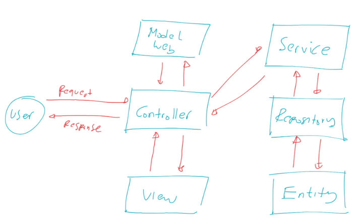

# belajar-spring-web-mvc
example spring web mvc

## Sejarah MVC
- MVC singkatan dari Model View Controller, yaitu salah satu software design pattern yang banyak digunakan ketika pengembangan aplikasi berbasis user interface
- MVC pertama kali dikenalkan oleh Trygve Reenskaug pada tahun 1970 ketika berkunjung ke Xerox Palo Alto Research
- Awalnya MVC banyak digunakan di aplikasi berbasis Desktop, namun sekarang MVC banyak diadopsi di Web
- Saat ini sendiri, design pattern MVC sudah banyak berkembang, ada hierarchical model-view-controller(HMVC), model-view-adapter(MVA), model-view-presenter(MVP), model-view-viewmodel(MVVM), dan lain-lain

## Model View Controller
Seperti singkatannya, MVC dibagi menjadi tiga bagian:
- Model, merupakan bagian yang mempresentasikan data. Seperti yang kita ketahui, ada banyak sekali jenis data, seperti data request, data response, data table, dan lain-lain, sehingga kadang kita perlu memperkecil lagi scope dari Model itu sendiri ketika membuat aplikasi.
- View, merupakan bagian yang mempresentasikan tampilan, seperti halaman web, desktop, mobile, dan lain-lain
- Controller, merupakan bagian yang mengurus alur kerja dari menerima input, memanipulasi data Model, sampai menampilkan View, Anggap saja Controller merupakan core logic dari apliakasi kita

## Pada Kenyataannya
- Walaupun sekilas MVC sangat sederhana, pada kenyataannya ketika kita membuat aplikasi yang kompleks, kita biasanya tidak lagi bisa memanfaatkan MVC
- Kadang kita butuh mengimplementasikan design pattern lain, seperti misal nya Service Pattern, Repository Pattern, dan lain-lain
- Oleh karena itu, jangan terlalu terpaku pada satu pattern, jika kita bisa mengkombinasikan beberapa pattern agar kode aplikasi kita lebih rapih dan baik, maka disarankan untuk melakukan kombinasi

User request, masuk ke controller, nanti dia akan mengirim ke service, service mengirim ke repository, repository memanipulasi entity, balik lagi ke atas, service kirim balik ke controller, di controller datanya di ubah menjadi response, lalu dikirim ke view, baru nanti di kembalikan ke user
sekilas mungkin keliatan seperti kompleks, tapi nanti ketika jadi aplikasinya ini lebih mudah di plihara (maintance).
Jadi ketika ada perubahan di logic aplikasi, kita hanya fokus di bagian service, ketika ada berubahan di logic databasenya kita hanya fokus di repository

- Model web : Request dan Response representasinya
- Entity : Data di database
- Repository : Jembatan untuk melakukan manipulasi data ke database
- Service : Logic aplikasi kita disimpan disini, jadi controller disitu tidak lagi menangani logic lagi. jadi tidak bloated (tidak bengkak isi controller nya) 

## Pengenalan Spring Web MVC
- Spring Web MVC(Model View Controller) adalah sebuah fitur di Spring untuk mempermudah membuat web menggunakan Java Servlet
- Pada kelas Java Servlet kita sudah tahu bagaimana sulitnya membuat web di Java Servlet karena semua harus dibuat secara manual
- Spring membuat fitur Web MVC yang bisa digunakan untuk mempermudah semua proses pembuatan Web

## Dispatcher Servlet
- Semua logic Spring Web MVC, diatur oleh sebuah servlet bernama DispatcherServlet 
- Servlet ini adalah gerbang utama masuknya request di Spring Web MVC 
- Dari DispatcherServlet, nanti akan diteruskan ke Controller yang sesuai dengan URL yang diakses
- https://docs.spring.io/spring-framework/docs/current/javadoc-api/org/springframework/web/servlet/DispatcherServlet.html 

## Cara Kerja Spring Web MVC

## Controller
- Untuk membuat Controller di Spring, kita bisa menggunakan annotation Controller
- Di annotation Controller sendiri, sebenarnya terdapat annotation Component, hal ini membuat class yang kita tambahkan annotation Controller, akan secara automatis teregistrasi sebagai Bean
- https://docs.spring.io/spring-framework/docs/current/javadoc-api/org/springframework/stereotype/Controller.html 

## Request Mapping 
- Saat kita belajar menggunakan Servlet, untuk membuat Routing pada Servlet kita menggunakan annotation WebServlet
- Di Spring WebMVC, untuk menambahkan Routing, kita bisa menggunakan annotation RequestMapping pada method yang ingin kita jadikan sebagai Controller Handler nya
- https://docs.spring.io/spring-framework/docs/current/javadoc-api/org/springframework/web/bind/annotation/RequestMapping.html 

## Menjalankan Web
- Spring Boot secara default menambahkan Apache Tomcat sebagai Embedded Web Server
- Hal ini menjadikan kita tidak perlu lagi untuk membuat aplikasi Spring Boot dalam bentuk War, dan tidak perlu melakukan deployment secara manual ke Apache Tomcat
- Secara default, Spring Boot menggunakan port 8080 untuk menjalankan Apache Tomcat nya
- Jika kita mengubah port nya, kita bisa gunakan properties
- server.port=NOMOR
- Pada application.properties

## Servlet Request dan Response
- Saat kita membuat Controller Handler dengan RequestMapping
- Kita bisa menambahkan parameter HttpServletRequest atau HttpServletResponse jika memang butuh object tersebut
- Tidak ada aturan posisi parameter, karena Spring WebMVC bisa mendeteksi secara automatis tipe dan posisi parameter nya

## Mock MVC
- Saat kita membuat Web menggunakan Spring WebMVC, Spring telah menyediakan fitur bernama MockMVC
- Fitur ini digunakan untuk mempermudah kita melakukan unit test
- Dengan menggunakan MockMVC, kita bisa mengetest semua Controller yang kita buat, tanpa harus menjalankan aplikasi Web nya, dan tidak perlu melakukan pengetesan secara manual menggunakan Browser atau HTTP Client
- https://docs.spring.io/spring-framework/docs/current/javadoc-api/org/springframework/test/web/servlet/MockMvc.html 

## Static Import
- Ketika menggunakan MockMVC, kita butuh beberapa static utility method dari class-class berikut
- MockMvcBuilders.*
- MockMvcRequestBuilders.*
- MockMvcResultMatchers.*
- MockMvcResultHandlers.*
