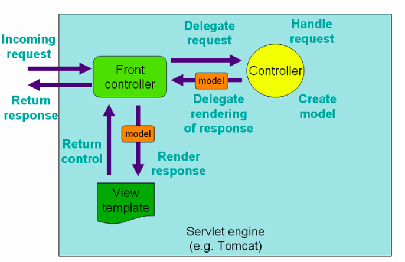

# belajar-spring-web-mvc
example spring web mvc

## Sejarah MVC
- MVC singkatan dari Model View Controller, yaitu salah satu software design pattern yang banyak digunakan ketika pengembangan aplikasi berbasis user interface
- MVC pertama kali dikenalkan oleh Trygve Reenskaug pada tahun 1970 ketika berkunjung ke Xerox Palo Alto Research
- Awalnya MVC banyak digunakan di aplikasi berbasis Desktop, namun sekarang MVC banyak diadopsi di Web
- Saat ini sendiri, design pattern MVC sudah banyak berkembang, ada hierarchical model-view-controller(HMVC), model-view-adapter(MVA), model-view-presenter(MVP), model-view-viewmodel(MVVM), dan lain-lain

## Model View Controller
Seperti singkatannya, MVC dibagi menjadi tiga bagian:
- Model, merupakan bagian yang mempresentasikan data. Seperti yang kita ketahui, ada banyak sekali jenis data, seperti data request, data response, data table, dan lain-lain, sehingga kadang kita perlu memperkecil lagi scope dari Model itu sendiri ketika membuat aplikasi.
- View, merupakan bagian yang mempresentasikan tampilan, seperti halaman web, desktop, mobile, dan lain-lain
- Controller, merupakan bagian yang mengurus alur kerja dari menerima input, memanipulasi data Model, sampai menampilkan View, Anggap saja Controller merupakan core logic dari apliakasi kita

## Pada Kenyataannya
- Walaupun sekilas MVC sangat sederhana, pada kenyataannya ketika kita membuat aplikasi yang kompleks, kita biasanya tidak lagi bisa memanfaatkan MVC
- Kadang kita butuh mengimplementasikan design pattern lain, seperti misal nya Service Pattern, Repository Pattern, dan lain-lain
- Oleh karena itu, jangan terlalu terpaku pada satu pattern, jika kita bisa mengkombinasikan beberapa pattern agar kode aplikasi kita lebih rapih dan baik, maka disarankan untuk melakukan kombinasi

User request, masuk ke controller, nanti dia akan mengirim ke service, service mengirim ke repository, repository memanipulasi entity, balik lagi ke atas, service kirim balik ke controller, di controller datanya di ubah menjadi response, lalu dikirim ke view, baru nanti di kembalikan ke user
sekilas mungkin keliatan seperti kompleks, tapi nanti ketika jadi aplikasinya ini lebih mudah di plihara (maintance).
Jadi ketika ada perubahan di logic aplikasi, kita hanya fokus di bagian service, ketika ada berubahan di logic databasenya kita hanya fokus di repository

- Model web : Request dan Response representasinya
- Entity : Data di database
- Repository : Jembatan untuk melakukan manipulasi data ke database
- Service : Logic aplikasi kita disimpan disini, jadi controller disitu tidak lagi menangani logic lagi. jadi tidak bloated (tidak bengkak isi controller nya) 

## Pengenalan Spring Web MVC
- Spring Web MVC(Model View Controller) adalah sebuah fitur di Spring untuk mempermudah membuat web menggunakan Java Servlet
- Pada kelas Java Servlet kita sudah tahu bagaimana sulitnya membuat web di Java Servlet karena semua harus dibuat secara manual
- Spring membuat fitur Web MVC yang bisa digunakan untuk mempermudah semua proses pembuatan Web

## Dispatcher Servlet
- Semua logic Spring Web MVC, diatur oleh sebuah servlet bernama DispatcherServlet 
- Servlet ini adalah gerbang utama masuknya request di Spring Web MVC 
- Dari DispatcherServlet, nanti akan diteruskan ke Controller yang sesuai dengan URL yang diakses
- https://docs.spring.io/spring-framework/docs/current/javadoc-api/org/springframework/web/servlet/DispatcherServlet.html 

## Cara Kerja Spring Web MVC

## Controller
- Untuk membuat Controller di Spring, kita bisa menggunakan annotation Controller
- Di annotation Controller sendiri, sebenarnya terdapat annotation Component, hal ini membuat class yang kita tambahkan annotation Controller, akan secara automatis teregistrasi sebagai Bean
- https://docs.spring.io/spring-framework/docs/current/javadoc-api/org/springframework/stereotype/Controller.html 

## Request Mapping 
- Saat kita belajar menggunakan Servlet, untuk membuat Routing pada Servlet kita menggunakan annotation WebServlet
- Di Spring WebMVC, untuk menambahkan Routing, kita bisa menggunakan annotation RequestMapping pada method yang ingin kita jadikan sebagai Controller Handler nya
- https://docs.spring.io/spring-framework/docs/current/javadoc-api/org/springframework/web/bind/annotation/RequestMapping.html 

## Menjalankan Web
- Spring Boot secara default menambahkan Apache Tomcat sebagai Embedded Web Server
- Hal ini menjadikan kita tidak perlu lagi untuk membuat aplikasi Spring Boot dalam bentuk War, dan tidak perlu melakukan deployment secara manual ke Apache Tomcat
- Secara default, Spring Boot menggunakan port 8080 untuk menjalankan Apache Tomcat nya
- Jika kita mengubah port nya, kita bisa gunakan properties
- server.port=NOMOR
- Pada application.properties

## Servlet Request dan Response
- Saat kita membuat Controller Handler dengan RequestMapping
- Kita bisa menambahkan parameter HttpServletRequest atau HttpServletResponse jika memang butuh object tersebut
- Tidak ada aturan posisi parameter, karena Spring WebMVC bisa mendeteksi secara automatis tipe dan posisi parameter nya

## Mock MVC
- Saat kita membuat Web menggunakan Spring WebMVC, Spring telah menyediakan fitur bernama MockMVC
- Fitur ini digunakan untuk mempermudah kita melakukan unit test
- Dengan menggunakan MockMVC, kita bisa mengetest semua Controller yang kita buat, tanpa harus menjalankan aplikasi Web nya, dan tidak perlu melakukan pengetesan secara manual menggunakan Browser atau HTTP Client
- https://docs.spring.io/spring-framework/docs/current/javadoc-api/org/springframework/test/web/servlet/MockMvc.html 

## Static Import
- Ketika menggunakan MockMVC, kita butuh beberapa static utility method dari class-class berikut
- MockMvcBuilders.*
- MockMvcRequestBuilders.*
- MockMvcResultMatchers.*
- MockMvcResultHandlers.*

## Integration Test
- Saat kita menggunakan MockMVC, Spring tidak akan menjalankan aplikasi web kita
- Spring hanya menyediakan mock request dan mock response
- Test yang mengsimulasikan saat aplikasi berjalan adalah menggunakan mode Integration Test
- Integration Test artinya adalah menjalankan aplikasi web secara lengkap, bersama dengan web server nya (Apache Tomcat)
- Secara otomatis kita bisa menjalankan aplikasi web ketika test berjalan, dan menghentikannya ketika test selesai

## Test Rest Template
- Berbeda ketika kita menggunakan MockMVC, saat menggunakan mode Integration Test, karena tidak menggunakan mock lagi, maka untuk mengetest aplikasi, kita harus benar-benar mengirim request ke aplikasi web
- Spring memiliki HTTP Client bernama RestTemplate, yang akan kita bahas di materi khusus
- Dan spesial untuk integration test, kita bisa menggunakan object TestRestTemplate

## Random Port
- Secara default, saat menjalankan Integration Test, spring akan menjalankan aplikasi sesuai dengan port di properties server.port
- Namun kadang-kadang, portnya bentrok dengan port lain, oleh karena itu direkomendasikan menggunakan random port
- Random port artinya Spring akan mencoba mendeteksi port yang belum digunakan, nanti secara otomatis akan menggunakan port tersebut
- Untuk mendapatkan nilai port nya, kita bisa menggunakan inject @Value("${local.server.port}") atau lebih mudah menggunakan @LocalServerPort

## Service Layer
- Di awal kita belajar tentang MVC(Model View Controller)
- Di bahasa pemrograman atau framework lain, biasanya orang menambahkan kode yang berhubungan dengan bisnis logic di Controller Layer, namun berbeda dengan programmer Java
- Untuk programmer Java, sebenarnya kebiasaan atau best practice nya akan membuat layer khusus untuk kode binis logic, bernama Service Layer
- Service Layer di Spring memiliki annotation khusus, yaitu @Service
- Saat kita menambahkan annotation @Service, secara otomatis juga class tersebut akan diregistrasikan sebagai bean
- https://docs.spring.io/spring-framework/docs/current/javadoc-api/org/springframework/stereotype/Service.html 

## Interface
- Salah satu best practice di Spring adalah, saat kita membuat Service Layer, kita akan buat dalam bentuk Interface
- Lalu kita akan buat class implementasi yang diregistrasikan sebagai Spring Bean
- Sedangkan class yang membutuhkan Service Layer tersebut, akan menggunakan Interface nya, bukan class implementasinya
- Salah satu keuntungan mengekspos Interface dibandingkan Class adalah, kita bisa mengubah atau mengganti isi dari class implementasi, tanpa berdampak pada class lain yang menggunakan interface nya

## Mock Bean
- Saat kita belajar di kelas Java Unit Test, kita sudah belajar tentang melakukan mock menggunakan Mockito
- Saat kita menggunakan Spring, kita juga melakukan hal tersebut
- Selain itu, Spring juga bisa secara otomatis meregistrasikan Mock object tersebut sebagai bean, sehingga class yang membutuhkan bean tersebut, secara otomatis bisa mendapatkan Mock object yang kita buat
- Untuk membuat Mock Bean, kita cukup gunakan annotation @MockBean
- https://docs.spring.io/spring-boot/docs/current/api/org/springframework/boot/test/mock/mockito/MockBean.html 

## Request Method
- Saat kita menggunakan RequestMapping terdapat attribute method yang bisa kita gunakan untuk menentukan jenis HTTP Method yang diperbolehkan
- Secara default, jika kita tidak memilihnya, maka Controller Method tersebut bisa diakses oleh seluruh jenis HTTP Method
- Jika kita mengirim method yang tidak diperbolehkan, maka Spring akan menolak dengan response 405 Method Not Allowed

## Shortcut Annotation
- GET - @GetMapping
- POST - @PostMapping
- PUT - @PutMapping
- PATCH - @PatchMapping
- DELETE - @DeleteMapping

## Request Param
- Saat kita belajar Java Servlet, kita sudah tahu untuk mendapatkan Query/Request Parameter dari ServletRequest 
- Namun di Spring, kita bisa menggunakan Annotation @RequestParam untuk memberitahu bahwa kita membutuhkan request parameter 
- Selain itu, kita bisa menambahkan apakah query parameter itu wajib atau tidak, dan juga bisa menambahkan default value nya jika tidak dikirim oleh user 
- Secara otomatis data request parameter akan dikirim datanya ke parameter yang kita tentukan
- https://docs.spring.io/spring-framework/docs/current/javadoc-api/org/springframework/web/bind/annotation/RequestParam.html 

## Konversi Tipe data
- Kita tahu bahwa query parameter itu datanya adalah String
- Namun jika kita membutuhkan datanya dalam bentuk tipe data lain, Spring bisa secara otomatis melakukan konversi tipe datanya menggunakan fitur Converter yang pernah kita bahas di materi Spring Config Properties

## Response Body
- Secara default, kita harus menuliskan response dari Controller Method ke HttpServletResponse
- Namun hal ini kadang menyulitkan jika misal kita hanya ingin mengembalikan data berupa String
- Spring memiliki annotation @ResponseBody, yang bisa secara otomatis menjadikan data yang dikembalikan dari Controller Method menjadi data yang ditulis ke HttpServletResponse
- https://docs.spring.io/spring-framework/docs/current/javadoc-api/org/springframework/web/bind/annotation/ResponseBody.html 

## Request Content Type
- Saat kita membuat Controller Method, kita juga bisa membatasi jenis Content-Type yang dikirim oleh user
- Contoh pada kasus melakukan submit data form, kita biasanya meminta Content-Type yang dikirim oleh user adalah application/x-www-form-urlencoded
- Untuk membatasi tipe Content-Type, kita bisa tambahkan di @RequestMapping pada attribute consume

## Response Content Type
- Di @RequestMapping, selain consume, terdapat juga attribute produce, yang bisa kita gunakan untuk memberi tahu di HTTP Response, Content-Type dari response body yang dikembalikan

## Request Header
- Untuk mendapatkan Http Request Header, seperti yang sudah kita pelajari di materi Java Servlet, kita bisa mendapatkannya melalui HttpServletRequest
- Namun Spring WebMVC memiliki cara lebih mudah dengan menggunakan annotation @RequestHeader
- Caranya kita bisa tambahkan di parameter di Controller Method
- Kita juga bisa menentukan apakah wajib atau tidak, dan juga default value nya
- Selain itu, fitur Converter juga bisa digunakan untuk Request Header
- https://docs.spring.io/spring-framework/docs/current/javadoc-api/org/springframework/web/bind/annotation/RequestHeader.html 

## Path Variable
- Salah satu fitur Spring WebMVC yang berbeda dar Java Servlet adalah Path Variable
- Path Variable adalah fitur dimana kita bisa membantu patterns pada URL Path, dan mengambil nilai yang terdapat di URL Path nya
- Dengan fitur ini, kita bisa membuat URL Path yang dinamis, dan bisa mendapatkan nilai dinamis di URL Path nya secara otomatis
- Untuk menggunakan fitur ini, kita perlu tambahkan variable path nya di URL Path nya, dan juga menambahkan parameter dengan annotation @PathVariable
- Path Variable juga memiliki kemampuan otomatis konversi tipe data dengan Converter
- https://docs.spring.io/spring-framework/docs/current/javadoc-api/org/springframework/web/bind/annotation/PathVariable.html

## Forn Request
- Seperti pernah kita bahas di materi Java Servlet, untuk mendapatkan data Form Request, kita bisa menggunakan cara yang sama dengan mendapatkan data di Query Parameter
- Begitu pula di Spring Web MVC
- Untuk mendapatkan data di Form Request, kita bisa menggunakan annotation @RequestParam
- Secara otomatis Spring Web MVC juga akan mengembil data dari Form Request atau Query Parameter
- Seperti yang pernah kita praktekan di materi Request Content Type

## Upload File
- Upload File di Spring Web MVC bisa menggunakan cara seperti di Java Web Servlet, atau bisa menggunakan fitur di Spring Web MVC yang lebih mudah menggunakan annotation @RequestPart
- https://docs.spring.io/spring-framework/docs/current/javadoc-api/org/springframework/web/bind/annotation/RequestPart.html
- Untuk tipe data pada parameter nya, kita bisa gunakan MultipartFile
- https://docs.spring.io/spring-framework/docs/current/javadoc-api/org/springframework/web/multipart/MultipartFile.html 

## Upload File Properties
- Spring memiliki pengaturan yang bisa kita atur untuk Upload File, misal kita ingin membatasi jumlah ukuran file, dan lain-lain
- Semua pengaturan untuk upload file bisa kita tambahkan di application.properties, dengan prefix spring.servlet.multipart
- Kita bisa lihat daftarnya disini :
- https://docs.spring.io/spring-boot/docs/current/reference/html/application-properties.html#appendix.application-properties.web 

## Request Body
- Saat kita membuat aplikasi web berupa RESTful API, kadang kita ingin mengirim data lewat Request Body dalam bentuk format data seperti JSON, XML, dan sejenisnya
- Spring bisa digunakan untuk membaca data Request Body secara mudah, cukup menggunakan annotation @RequestBody
- https://docs.spring.io/spring-framework/docs/current/javadoc-api/org/springframework/web/bind/annotation/RequestBody.html 

## Response Status
- Saat kita membuat HTTP Response, kadang kita ingin mengubah Response Status Code 
- Secara default, response sukses adalah 200, kadang mungkin kita ingin ubah secara manual 
- Jika kita ingin ubah secara dinamis, kita bisa gunakan HttpServletResponse 
- Atau jika kita ingin hardcode response status nya, kita bisa gunakan annotation @ResponseStatus di Controller Method nya
- https://docs.spring.io/spring-framework/docs/current/javadoc-api/org/springframework/web/bind/annotation/ResponseStatus.html 

## Response Entity
- Sekarang kita sudah tahu beberapa cara membuat HTTP Response, dari menggunakan HttpServletResponse dan @ResponseBody 
- Spring menyediakan cara yang sangat flexible untuk membuat HTTP Response menggunakan object ResponseEntity 
- Kita bisa return di Controller Method dengan object ResponseEntity
- https://docs.spring.io/spring-framework/docs/current/javadoc-api/org/springframework/http/ResponseEntity.html 

## Cookie
- Cara membuat Cookie di Spring Web MVC bisa dilakukan dengan menggunakan HttpServletResponse seperti pada Java Servlet 
- Namun untuk membaca Cookie yang dikirim oleh Web Browser, kita bisa otomatis menggunakan annotation @CookieValue
- https://docs.spring.io/spring-framework/docs/current/javadoc-api/org/springframework/web/bind/annotation/CookieValue.html 

## Model Attribute
- Saat kita mengirim request berupa form dengan input yang banyak, kadang menyulitkan kita jika kita harus membuat semua parameter input dengan @RequestParam
- Bayangkan jika ada 10 input, maka kita harus membuat 10 parameter @RequestParam
- Spring memiliki fitur dimana kita bisa melakukan binding attribute yang dikirim dengan class Java Bean yang kita buat menggunakan annotation @ModelAttribute
- https://docs.spring.io/spring-framework/docs/current/javadoc-api/org/springframework/web/bind/annotation/ModelAttribute.html 

## Nested Model
- Salah satu yang powerfull di Model Attribute adalah, kita bisa otomatis juga membuat object dari nested attribute di Model
- Misalnya pada kasus Person sebelumnya, misal saja terdapat sebuah attribute Address yang merupakan Java Bean lainnya
- Untuk mengisi data Address, kita bisa gunakan . (titik), misal address.street, address.city dan seterusnya

## List
- Selain nested attribute, kita juga bisa menggunakan List sebagai model attribute, cara mengirim parameter nya cukup mudah
- Untuk list dengan tipe data primitive seperti String, Integer dan sejenisnya, kita bisa gunakan parameter:
  - namaParam[0]=data1
  - namaParam[1]=data2
  - Dan seterusnya
- Untuk list dengan tipe data object Java Bean lainnya, kita bisa gunakan parameter:
  - namaParam[0].field1=data1 
  - namaParam[0].field2=data2
  - namaParam[1].field1=data1
  - namaParam[1].field2=data2

## JSON
- Seperti Web MVC terintegrasi dengan baik dengan library Jackson untuk menangani tipe data JSON, baik untuk consume dari Request Body atau produce ke Response Body
- Saat kita menggunakan consume dengan tipe data JSON atau produce dengan tipe data JSON, kita tidak perlu secara manual melakukan konversi dari object ke JSON String, hal itu sudah otomatis di handle oleh Jackson

## Konfigurasi Jackson
- Kita tidak perlu membuat Bean Jackson secara manual lagi, karena itu sudah di handle oleh Spring Boot
- Jika kita butuh melakukan konfigurasi untuk Jackson, kita bisa menggunakan application properties
- Semua daftar konfigurasinya bisa kita gunakan dengan prefix spring.jackson.
- https://docs.spring.io/spring-boot/docs/current/reference/html/application-properties.html#appendix.application-properties.json

## Validation
- Spring WebMVC terintegrasi dengan baik dengan Bean Validation seperti yang sudah kita bahas di materi Spring Validation
- Saat kita membuat parameter @ModelAttribute atau @RequestBody, jika object tersebut ingin di validasi secara otomatis menggunakan Bean Validation, kita bisa tambahkan annotation @Valid
- Jika data tidak valid, secara otomatis Spring akan mengembalikan response 400 Bad Request
- Khusus validasi di Controller, exception yang akan dibuat adalah MethodArgumentNotValidException bukan ConstraintViolationException nya Bean Validation

## Exception Handler
- Saat terjadi error di Controller, seperti validation error, logic error, dan lain-lain
- Secara default, Spring akan mengembalikan response error sesuai jenis errornya
- Kadang, kita ingin membuat halaman atau response error sendiri
- Hal ini bisa kita buat dengan menggunakan @ControllerAdvice
- https://docs.spring.io/spring-framework/docs/current/javadoc-api/org/springframework/web/bind/annotation/ControllerAdvice.html 

## Controller Advice
- Controller Advice adalah sebuah class yang dipanggil ketika sebuah jenis exception terjadi
- Dengan begitu kita bisa memanipulasi response yang akan dikembalikan ke user menggunakan Controller Advice ini
- Jadi ini bener-benar mirip seperti Controller biasa, cuman bedanya itu akan di eksekusi ketika terjadi exception yang tidak di handle oleh si Controller nya
- Contohnya, kita menambahkan Bean Validation, dia kan nanti error method, method argument not valid, nah kita bisa tambahkan Controller Advice untuk menghandle exception jenis tersebut

Nah selanjutnya bagaimana kalau kita mau menghandle tiap jenis exceptionnya

### Exception Handler
- Setelah membuat Controller Advice, untuk menangkap exception dan mengubah response nya, kita perlu membuat Method seperti di Controller biasa
- Namun kita tidak menggunakan annotation @RequestMapping, melainkan @ExceptionHandler
- https://docs.spring.io/spring-framework/docs/current/javadoc-api/org/springframework/web/bind/annotation/ExceptionHandler.html 
- Kita harus tentukan jenis exception apa yang akan ditangkap, kalau temen-temen menggunakan Parent Exception nya, maka semua Child Exception nya akan ditangkap juga, dan jika butuh data exception nya, kita bisa tambahkan sebagai parameter di Method nya

## Error Page
- Saat terjadi exception yang tidak tertangani oleh Exception Handler, secara default Spring WebMVC akan mengirim detail errornya ke path "/error"
- jika tidak ada Controller Method dengan Route/error, maka Spring akan menampilkan default Page untuk error tersebut

## Error Page Properties
- Secara default, detail error tidak ditampilkan di error page, hal ini agar stacktrace tidak terexpose ketika terjadi error
- Semua detail properties untuk error page bisa kita setting di application properties dengan prefix server.error
- https://docs.spring.io/spring-boot/docs/current/reference/html/application-properties.html#appendix.application-properties.server 

## Membuat Error Detail Sendiri
- Kita juga bisa membuat error detail page sendiri jika mau, namun kita harus mematikan fitur error detail page bawaan dari Spring Boot dengan menambahkan properties
- server.error.whitelabel.enable=false
- Selanjutnya kita bisa membuat controller dengan route /error, namun kita wajib mengimplement interface ErrorController
- https://docs.spring.io/spring-boot/docs/current/api/org/springframework/boot/web/servlet/error/ErrorController.html
- Dan ketika kita membuat error page, jika ingin mendapatkan detail errornya, kita bisa menggunakan HttpServletRequest, dengan mengambil attribute dengan key prefix RequestDispatcher.ERROR_*

## Binding Result
- Secara default, jika terjadi error di @ModelAttribute atau @RequestBody, maka akan throw exception MethodArgumentNotValidException
- Kadang kita tidak ingin hal itu terjadi, misal kita ingin tetap masuk ke Controller Method, karena di dalam nya kita ingin menampilkan halaman errornya misalnya
- Pada kasus seperti itu, kita bisa tambahkan parameter BindingResult di sebelah parameter nya, secara otomatis detail error akan dimasukan ke object BindingResult
- https://docs.spring.io/spring-framework/docs/current/javadoc-api/org/springframework/validation/BindingResult.html 

## Session Attribute
- Seperti yang pernah dibahas di materi Java Servlet, bahwa di Java Servlet, kita bisa membuat Session
- Spring WebMVC menyediakan cara mudah untuk mengakses data di Session menggunakan annotation @SessionAttribute
- https://docs.spring.io/spring-framework/docs/current/javadoc-api/org/springframework/web/bind/annotation/SessionAttribute.html 
- Tapi perlu diingat Session itu datanya di simpan di memory si aplikasinya, jadi nanti temen-temen kalau jalankan 2 aplikasi yang berbeda maka sessionnya tidak akan bergabung. makannya penggunaan session sebenarnya ini jarang digunakan ketika aplikasinya lebih dari 1 server

